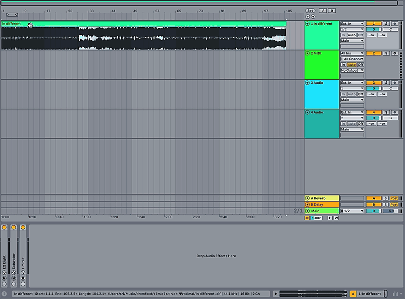

# Stem Separation

**Released:** April 21, 2026

**Edition:** Live 12

---

Stem separation is the process of splitting a mixed audio track (e.g., a song) into individual “stems” such as **vocals**, **drums**, **bass**, and **others**. Parts which are not identified as being vocals drums or bass, will be categorized as "other". With the new version of Live Suite, this is now possible to run locally.

---

### How to Use

The feature can be accessed using audio files from the browser or by choosing clips from the Session or Arrangement View.

1. Right-click a sample in the browser or a clip in the Session or Arrangement view
2. Select **Separate Stems to New Audio Tracks**
3. A pop-up menu will appear — select either **High Quality** or **High Speed** output

While a high-speed output will yield results much faster, the quality will differ from the high-quality output.

---

### High Speed and High Quality

The difference between the two modes is determined by the number of separation passes performed.

| Mode | Passes | Result |
|---|---|---|
| **High Speed** | Single pass | Faster output, lower separation accuracy |
| **High Quality** | Individual pass per stem | Slower output, higher separation accuracy |

---

### When to Use It

Results vary depending on source material, mix quality, and genre. Stem separation works well when you need to:

- Create remixes or instrumentals
- Apply processing such as EQ or compression to an isolated part of the mix
- Remove or isolate vocals
- Improve transcription accuracy

---

### Performance

On computers running macOS 26.4 and above, stem separation can now use the GPU instead of the CPU, which significantly speeds up processing time.

---

### Supported Formats

| Status | Formats |
|---|---|
| **Supported** | WAV, AIFF, AIFF-C, FLAC, OGG Vorbis, MP3, M4A |
| **Not supported** | Multi-channel files, ADM — convert to a supported format first |

---

### File Naming

Separated stems are named automatically using the following convention:

| Stem | Name |
|---|---|
| Vocals | `Vocals "track name"` |
| Drums | `Drums "track name"` |
| Bass | `Bass "track name"` |
| Others | `Others "track name"` |

---

### FAQ

**Does this remove vocals perfectly?**

No. Stem separation is best-effort. Results vary by genre, mix quality, and source material.

**Can I separate more than four stems?**

No. The current version outputs four stems only.

---

#### Changelog

| Version | Change |
|---|---|
| **12.3.7** | Stem separation can now use the GPU on macOS 26.4 and above |
| **12.3** | First release of Stem Separation |